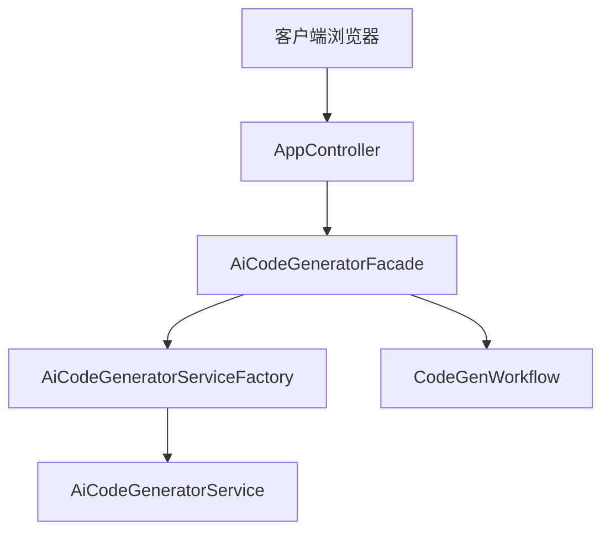

# 本文档由[](https://deepwiki.com/WeiWu-code/ai-code-gen)生成，可点击查看解析

# WW AI Code Generator

一个基于AI的智能代码生成系统，能够根据自然语言描述自动生成前端代码。

## 🚀 功能特性

- **多模式代码生成**：支持三种生成模式
  - `HTML`：生成单文件HTML页面
  - `MULTI_FILE`：生成分离的HTML、CSS、JS文件
  - `VUE_PROJECT`：生成完整的Vue 3项目 ai-code-gen:7-11 

- **智能类型路由**：AI自动选择最适合的代码生成类型 ai-code-gen:303-306 

- **流式生成**：支持SSE流式输出，实时显示生成进度 ai-code-gen:35-55 

- **工作流引擎**：基于LangGraph4j的代码生成工作流，包含图片收集、代码生成、质量检查等步骤 ai-code-gen:35-57 

- **文件系统工具**：AI可直接操作文件系统，支持文件读写、修改等操作 ai-code-gen:22-50 

- **自动部署**：支持一键部署到静态服务器，自动截图并上传到云存储 ai-code-gen:278-290 

## 🛠 技术栈

- **后端框架**：Spring Boot 3.5.8 ai-code-gen:5-9 
- **Java版本**：Java 21 ai-code-gen:29-31 
- **AI框架**：LangChain4j 1.1.0 ai-code-gen:104-108 
- **工作流引擎**：LangGraph4j 1.6.0-rc2 ai-code-gen:52-57 
- **数据库**：MySQL + MyBatis-Flex ai-code-gen:39-43 
- **缓存**：Redis + Caffeine ai-code-gen:46-63 
- **API文档**：Knife4j 4.4.0 ai-code-gen:134-138 

## 📦 快速开始

### 环境要求

- Java 21+
- MySQL 8.0+
- Redis 6.0+
- Node.js 18+ (用于Vue项目构建)

### 配置步骤

1. **克隆项目**
```bash
git clone https://github.com/WeiWu-code/ai-code-gen.git
cd ai-code-gen
```

2. **数据库初始化**
```sql
    -- 执行 sql/init.sql 创建数据库和表
```

3. **配置文件**
    - 复制 `config/local.yaml.example` 为 `config/local.yaml`
    - 配置AI模型API密钥、数据库连接等信息 ai-code-gen:1-44 

4. **启动应用**
```bash
mvn spring-boot:run
```

应用将在 `http://localhost:9010` 启动

## 🏗 系统架构

### 核心组件



### 代码生成流程

1. **应用创建**：用户输入初始描述，AI智能选择生成类型 ai-code-gen:293-311 
2. **代码生成**：根据选择的类型调用相应的AI服务
3. **流式输出**：通过SSE实时返回生成进度
4. **文件保存**：解析AI输出并保存到文件系统
5. **项目构建**：Vue项目自动执行npm build
6. **部署发布**：部署到静态服务器并生成截图

## 📚 API文档

启动应用后访问 `http://localhost:9010/doc.html` 查看完整的API文档。

主要接口：

- `POST /api/app/add` - 创建新应用
- `GET /api/app/chat/gen/code` - 流式生成代码
- `POST /api/app/deploy` - 部署应用

## 🔧 开发指南

### 添加新的代码生成模式

1. 在 `CodeGenTypeEnum` 中添加新的枚举值 ai-code-gen:7-19 
2. 创建对应的系统提示文件到 `src/main/resources/prompt/`
3. 在 `AiCodeGeneratorService` 中添加新的方法 ai-code-gen:11-57 
4. 更新 `AiCodeGeneratorFacade` 中的路由逻辑

### 扩展工作流节点

工作流采用节点化设计，可在 `CodeGenWorkflow` 中添加新节点 ai-code-gen:35-57 。

## 📄 许可证

本项目采用 MIT 许可证。

## 🤝 贡献

欢迎提交 Issue 和 Pull Request！

## Notes

- 项目使用Spring Session + Redis管理用户会话
- AI服务实例通过Caffeine缓存以提高性能
- 支持虚拟线程执行异步任务（如截图生成）
- 文件操作工具具有沙盒安全机制，防止路径越界攻击

Wiki pages you might want to explore:
- [Overview (WeiWu-code/ai-code-gen)](/wiki/WeiWu-code/ai-code-gen#1)
- [Core AI Code Generation (WeiWu-code/ai-code-gen)](/wiki/WeiWu-code/ai-code-gen#3)

```
